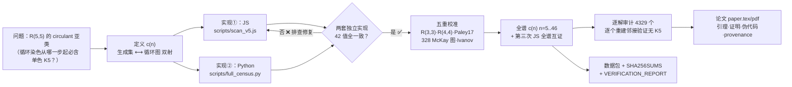

# Ramsey(5,5) Circulant Census

<p align="center">


</p>

> **关键词 / Keywords（中英双语）**：拉姆齐数 Ramsey numbers · 循环图 circulant graphs ·
> 计数普查 census · 最大阶 41 · 排除带 42–46 · 双实现互证 double-implementation ·
> 可复现 reproducible · 穷举证明 exhaustive proof · 组合学 combinatorics · 图论 graph theory


# 项目介绍 (Project Introduction)

## 这个项目在数学上有什么用？ / What is the mathematical value?

### 1. 给 R(5,5) 的研究者省了力气 / Saving effort for R(5,5) researchers

R(5,5) 是目前最著名的未解拉姆齐数之一，已知范围 43 ≤ R(5,5) ≤ 46。
历史上大部分拉姆齐下界构造都来自 circulant（循环图）——对称性好、易于搜索。
但有一个问题从未被回答：**circulant 这条路到底能走多远？**

> R(5,5) is among the most famous open Ramsey numbers, known to lie in 43 ≤ R(5,5) ≤ 46.
> Most known Ramsey lower-bound constructions are circulant — symmetric and easy to search.
> But one question was never answered: **how far can the circulant approach go?**

本项目给出了精确答案：**41 就是尽头**。42 个顶点及以上的循环染色必然含单色 K₅。
从此以后，搜索 R(5,5) 下界的研究者不再需要在这条路上耗费算力。

> This project gives the exact answer: **41 is the end**. Every circulant coloring on 42 or
> more vertices must contain a monochromatic K₅. Researchers searching for R(5,5) lower
> bounds no longer need to spend compute on circulant constructions — this path is sealed.

### 2. 补上了 circulant Ramsey 理论的一个缺口 / Filling a gap in circulant Ramsey theory

Harborth & Krause (2003) 完成了 circulant 三角形（K₃）的完整普查，但 20 多年来
K₅ 的情形一直悬空。本项目把 n = 5..46 的完整谱系 c(n) 全部算了出来，
补上了那篇经典工作的 (5,5) 版本。

> Harborth & Krause (2003) completed the full census of circulant triangles (K₃), but the
> K₅ case had been open for over two decades. This project computes the full spectrum
> c(n) for n = 5..46, completing the (5,5) analogue of that classic work.

### 3. 提供了一个可复现计算的范本 / A model of reproducible computation

每个数字都经两套独立实现（JavaScript + Python）交叉验证，4329 个解逐个重建审计，
全部配 SHA256 校验和。任何人在一台笔记本上 20 分钟即可复现全部结果。

> Every figure is cross-verified by two independent implementations (JavaScript + Python),
> all 4329 solutions are audited one by one, and everything ships with SHA256 checksums.
> Anyone can reproduce every result in 20 minutes on a laptop.

### 4. 附带发现：逼迫性在循环图里不单调 / Forcing is not monotone in the circulant class

c(39) = 0 但 c(40) = 12、c(41) = 20：染色在 39 个顶点消失，却在 40、41 个顶点复活。
这一现象意味着"最小逼迫阶"与"最大存在阶"两种描述方式在 (5,5) 情形下不再等价。

> c(39) = 0 yet c(40) = 12, c(41) = 20: colorings vanish at 39 vertices and reappear at
> 40 and 41. This non-monotonicity shows that "smallest forcing order" and "largest
> existence order" are no longer equivalent descriptions in the (5,5) case.

### 核心产出 / Core outputs

| 项目 / Item | 说明 / Description |
|---|---|
| 完整的 c(n) 谱系 / Full spectrum c(n) | n = 5..46 共 42 个值，双实现互证 / 42 values, double-verified |
| 最大阶 41 的 20 个生成集 / 20 extremal sets at n = 41 | 极值对象全部列出 / Explicitly listed for reuse |
| 42–46 的排除证明 / Exclusion proof for 42–46 | 44、45 首次排除，42、43 与 Ivanov 2026 一致 / 44, 45 new; 42, 43 agree with Ivanov 2026 |
| 可复现的代码和数据 / Reproducible code & data | 20 分钟复现，SHA256 校验 / 20-min reproduction, SHA256-verified |
| 7 页论文 / 7-page paper | 引理、伪代码、证明、数据来源 / Lemmas, pseudocode, proofs, provenance |

---

**TL;DR (English)**: Largest circulant Ramsey(5,5) coloring = **41 vertices** (exactly 20
generating sets = 10 complement pairs). **Zero** circulant colorings for 42 ≤ n ≤ 46
(n = 44, 45 new). Full census c(n), n = 5..46, double-verified in JS + Python with a
4329-set audit. 7-page LaTeX paper included. R(5,5) itself stays 43 ≤ R(5,5) ≤ 46 — we
don't claim it.

---

> **Main results**
> 1. The largest circulant Ramsey(5,5) coloring has **41 vertices**, attained by exactly
>    **20 generating sets** (10 up to complementation).
> 2. **No** circulant Ramsey(5,5) coloring exists for any 42 ≤ n ≤ 46; with R(5,5) ≤ 46
>    (Angeltveit–McKay 2024) every circulant 2-coloring of K_n, n ≥ 42, contains a
>    monochromatic K_5 — circulant constructions cannot witness R(5,5) ≥ 43.
> 3. Forcing is not monotone in the circulant class: c(39) = 0 but c(40), c(41) > 0
>    (reported as a (5,5)-specific computational observation; no priority claim).

All numbers were produced by **two independent implementations** (JavaScript and Python)
that agree on every figure (full census n = 5..46 cross-run in both), and cross-validated
against R(3,3)=6, R(4,4)=18, Paley(17), the 328 published Ramsey(5,5;42) graphs, and
Ivanov (2026). See ORIGINALITY.md and NOVELTY_VETTING.md for the originality statement.

---

## 项目建设：怎么做的 (How this project was built)

> 一句话：**双实现 → 五重校准 → 三次全谱互证 → 逐解审计 → 论文+数据包**，每一步可复现、有据可查。

### Pipeline（mermaid，GitHub 直接渲染）



### 技术栈

| 环节 | 工具 |
|---|---|
| 穷举扫描（两套独立实现） | Node.js（位掩码）、Python 3.12 + multiprocessing |
| 团检测 | 43-bit 位掩码 + 三角形-公共邻域含边判据（论文 Lemma） |
| 数据验证 | 逐解重建邻接 + SHA256 校验和 |
| 图形 | matplotlib（矢量 PDF） |
| 排版 | LaTeX / pdflatex |

### 可信度链条（每环有证据）

1. **两套实现**（JS / Python）独立编写：42 个 c(n) 全一致；n=41 的 20 个解逐条相等；
2. **第三遍 JS 全谱**重跑与 counts.csv 逐行一致；
3. **五重校准**：R(3,3)=6、R(4,4)=18、Paley(17)、328 个 (5,5;42) 图、Ivanov(2026) 42/43 排除；
4. **4329 个生成集逐个验证**通过（G 与补图均无 K5）；
5. **审计抓到并修复**：解集文件曾不完整 → 全量重导；文字错误 → 修正；校验和 → 更新（DISCOVERY.md / NOVELTY_VETTING.md）。

### 复现（约 20 分钟，笔记本即可）

```bash
for N in $(seq 5 46); do node scripts/scan_v5.js $N 5 0 99; done   # ① JS 全谱（约 6 分钟）
python3 scripts/full_census.py                                     # ② Python 独立实现（约 15 分钟，8 核）
#    期望输出: PY FULL CENSUS done. mismatches: NONE (all 42 n agree with JS)
cd results && sha256sum -c SHA256SUMS                              # ③ 校验和全绿
```

> **突出点**：不是"跑一次搜到答案"，而是 **双实现 + 三次全谱 + 4329 逐解审计**的可辩护计算。

---

## File-by-file guide (what each file is for)

| Path | Purpose |
|---|---|
| paper/paper.tex | LaTeX manuscript (submit-ready; 7 pages). Compile: pdflatex paper.tex ×2 |
| paper/paper.pdf | Compiled PDF |
| paper/paper.html | Quick human-readable preview |
| paper/fig_spectrum.pdf/.png | Vector/raster spectrum figure |
| results/CR55/counts.csv | **Primary data**: 42 rows "n, candidates, c(n)" |
| results/CR55/sets_n*.txt | Explicit generating sets for each n with c(n) > 0 |
| results/CR55/README.md | Data format documentation |
| results/validation/ | Paley(17), 328 (5,5;42)-graphs (graph6), verified JSONs |
| results/VERIFICATION_REPORT.md | Audit report (checksums/sets/text/PDF checks) |
| results/SHA256SUMS | SHA256 of every artifact |
| scripts/scan_v5.js / scan_dump.js | JS scanners (counting / full set dump) |
| scripts/full_census.py / xcheck3.py | Python multiprocessing scanners (independent) |
| ramsey/ + run_ramsey.py | Python toolkit: circulant / sat / search / verify |
| ORIGINALITY.md | Item-by-item originality statement + full cited references |
| NOVELTY_VETTING.md | Row-by-row reconciliation of reviewer critique |
| DISCOVERY.md | Research narrative (how it was found, errors fixed) |
| COVER_LETTER.md / GITHUB_ABOUT.md | Submission cover letter / GitHub About copy-paste |
| LICENSE / .gitignore | MIT / ignores build artifacts |

---

## Replicate / Main numbers / Integrity / Honest scope

- Full spectrum table: results/CR55/counts.csv (42 rows; JS and Python agree on all 42).
- Integrity: sha256sum -c results/SHA256SUMS.
- **Honest scope**: this work does NOT determine R(5,5) (still 43 ≤ R(5,5) ≤ 46). It settles
  the circulant subclass: spectrum, extremal order-41 objects (new), exclusions n = 44, 45
  (new), n = 42, 43 (agree with Ivanov 2026), n = 46 (by R(5,5) ≤ 46).

---

## References (full list with DOIs/URLs in paper/paper.tex and ORIGINALITY.md)

## License

MIT (code) / CC0 (data).
